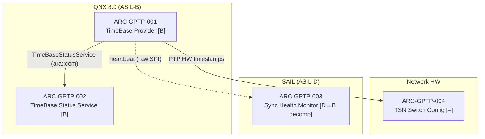

# ADAS Platform — Static Structure

Reference static decomposition (adjust AREA scope per feature; keep diagrams ≤ 12 elements).

## Reference view: TimeSync subsystem

Caption: static decomposition, concern = trustworthy platform time base,
addresses SYS-GPTP-001/002.

## Structural rules of thumb

- One component = one ASIL + one allocation target; split mixed elements
- Supervision components live on SAIL; supervised producers on QNX
- HW configuration (switch schedules, PHY setup) is modelled as elements too —
  they carry requirements and need verification
- Cross-domain edges are always raw-protocol interface elements, drawn dashed

## Where the real content goes

As features are worked, their static views land here (or in feature-specific
`*.architecture.md` files) after passing `commands/arch/validate-arch.sh`.
