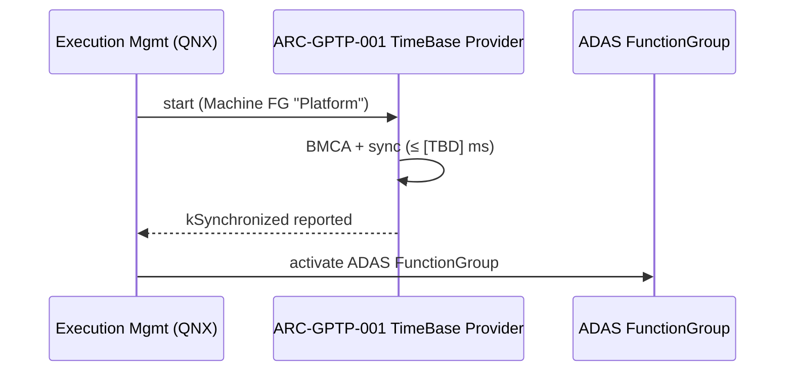
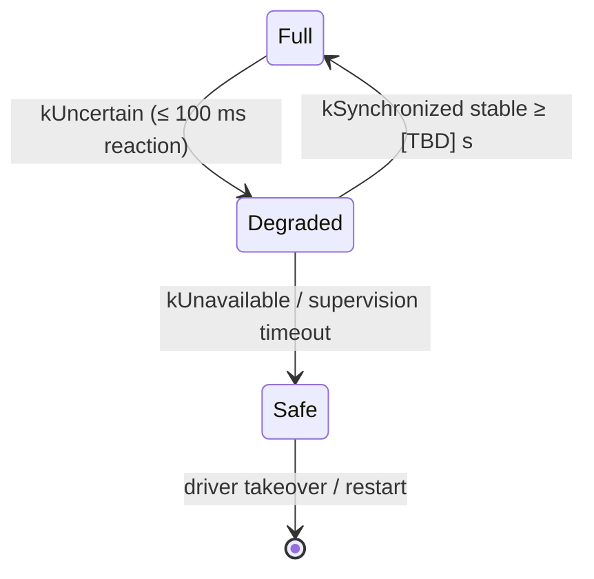

# ADAS Platform — Dynamic Behavior

Standard dynamic scenarios every feature architecture must cover.

## 1. Startup ordering

The platform pattern: infrastructure services reach their operational state **before**
dependent FunctionGroups activate.

Rule: activation gates are architecture elements' reported states — never timers.

## 2. Degradation ladder

Pattern for every feature: `full → degraded → safe state`, transitions driven by
health/time-base status events, each transition budgeted.

## 3. Fault reaction chain

detection (component) → DTC set → degradation manager → feature shedding, with the
end-to-end fault-reaction time compared against the requirement's FTTI budget.

Arrows in dynamic views carry timing budgets wherever a SYS-* requirement quantifies
them; unquantified arrows are findings to feed back into requirements.
